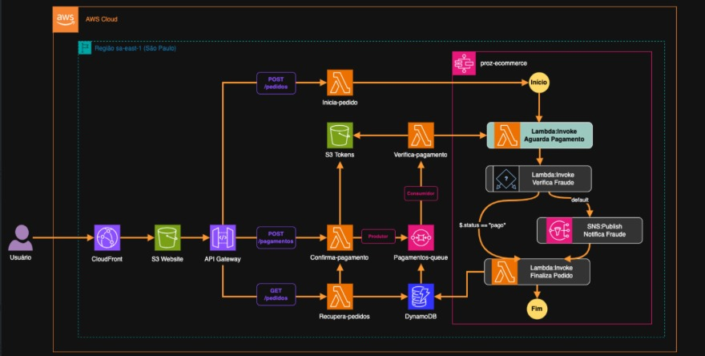

# Projeto de E-commerce com Arquitetura Serverless na AWS

## 1. Visão Geral do Projeto

Este repositório contém o código-fonte de uma aplicação de e-commerce completa, construída sobre uma arquitetura 100% serverless na nuvem da AWS. O objetivo deste projeto é demonstrar a implementação de uma solução robusta, escalável e de baixo custo para o varejo online, utilizando serviços gerenciados para minimizar a sobrecarga operacional.

A aplicação simula o fluxo completo de uma compra, desde a navegação e adição de produtos ao carrinho até a finalização do pedido com processamento de pagamento real através do gateway Stripe.

---

## 2. Arquitetura da Solução

O projeto é dividido em dois componentes principais: um **Front-end estático**, responsável pela interface do usuário, e um **Back-end serverless**, que lida com toda a lógica de negócio de forma assíncrona e orquestrada.

O fluxo de um pedido funciona da seguinte maneira:

1.  O usuário interage com o **Front-end**, hospedado no **Amazon S3** e distribuído globalmente pelo **Amazon CloudFront**.
2.  No checkout, o front-end utiliza o **Stripe.js** para coletar os dados de pagamento de forma segura, enviando-os diretamente ao Stripe e recebendo um token de pagamento em troca.
3.  O pedido, junto com o token do Stripe, é enviado para o **Amazon API Gateway**.
4.  O API Gateway atua como um gatilho para o **AWS Step Functions**, que inicia uma máquina de estados para orquestrar todo o processo de forma visual e controlada.
5.  A Step Function aciona uma função **AWS Lambda** (escrita em Python), que usa o token para solicitar a efetivação da cobrança junto à **API do Stripe**.
6.  Com a resposta do Stripe, a Lambda informa o sucesso ou a falha do pagamento à Step Function, que conclui a execução, registrando o pedido como "pago" ou "falhou".

### Diagrama da Arquitetura

*(É altamente recomendado que você crie um diagrama no https://app.diagrams.net/ e o adicione aqui. Ele valoriza imensamente o projeto.)*

---

## 3. Detalhes dos Componentes

A seguir, uma explicação detalhada sobre cada parte do projeto.

### 3.1. Front-end: Site Estático no Amazon S3 com Distribuição via CloudFront

O front-end da aplicação foi desenvolvido como um **site estático**, utilizando HTML, CSS e JavaScript puro, e seus arquivos são armazenados no **Amazon S3**.

O S3 é configurado para a hospedagem, garantindo uma solução de armazenamento de **alta durabilidade e baixo custo**.

Para otimizar a distribuição de conteúdo globalmente, reduzir a latência para os usuários e adicionar uma camada de segurança com HTTPS, a arquitetura utiliza o **Amazon CloudFront**. O CloudFront, serviço de CDN (Content Delivery Network) da AWS, atua como a porta de entrada para os usuários, entregando o conteúdo do S3 a partir de *Edge Locations* próximas a eles e gerenciando o certificado SSL.

### 3.2. Back-end: Orquestração Serverless na AWS

O coração do projeto é seu back-end, que opera sem servidores provisionados, utilizando uma combinação de serviços da AWS:

* **Amazon API Gateway:** Serve como a porta de entrada (endpoint HTTP) para todas as requisições do front-end. Ele é responsável por autenticar e direcionar as chamadas para os serviços corretos.
* **AWS Step Functions:** Atua como o "cérebro" da operação, orquestrando o fluxo do pedido em uma máquina de estados visual. Ele controla a ordem das tarefas, trata erros e gerencia retentativas, tornando o processo de negócio resiliente e fácil de depurar.
* **AWS Lambda:** Executa a lógica de negócio em Python. A função principal é responsável por se comunicar com a API do Stripe para processar o pagamento, utilizando as informações recebidas do front-end.

### 3.3. Gateway de Pagamento: Integração com Stripe

Para processar os pagamentos, o projeto é integrado ao **Stripe**, um dos gateways de pagamento mais seguros e utilizados no mercado. A integração segue as melhores práticas de segurança:

* **Lado do Cliente (Client-side):** O **Stripe.js** é usado no front-end para criar um formulário de pagamento seguro. Os dados do cartão de crédito do cliente nunca tocam nos servidores da aplicação; eles são enviados diretamente para o Stripe.
* **Lado do Servidor (Server-side):** A função Lambda recebe apenas um token de uso único do front-end e o utiliza para autorizar a cobrança, garantindo que informações sensíveis não sejam manipuladas ou armazenadas pela aplicação.

---

## 4. Tecnologias Utilizadas

* **Front-end:** HTML5, CSS3, JavaScript (ES6+), Stripe.js
* **Back-end:** Python 3.x
* **Infraestrutura AWS:**
    * Amazon S3
    * Amazon CloudFront
    * Amazon API Gateway
    * AWS Step Functions
    * AWS Lambda
    * AWS IAM (Identity and Access Management)
* **Pagamentos:** Stripe API

---

## 5. Como Executar o Projeto

*(Esta seção contém as instruções para que outra pessoa possa replicar seu ambiente)*

#### **Pré-requisitos:**

* Uma conta na **AWS** e uma conta no **Stripe**.
* AWS CLI configurado localmente.
* Python 3.x e pip instalados.

#### **Configuração do Back-end:**

1.  **Dependências:** A função Lambda que processa o pagamento requer a biblioteca do Stripe. Crie um arquivo `requirements.txt` com `stripe` e instale-o na pasta do projeto com `pip install -r requirements.txt -t .`.
2.  **Deploy:** Crie um pacote `.zip` contendo o código da Lambda (`lambda_function.py`) e suas dependências. Faça o upload para a AWS Lambda.
3.  **Variáveis de Ambiente:** Configure a chave secreta da API do Stripe (`STRIPE_API_KEY`) como uma variável de ambiente na sua função Lambda para manter a segurança.
4.  **Orquestração:** Crie a máquina de estados no AWS Step Functions e configure o API Gateway para iniciá-la.

#### **Configuração do Front-end:**

1.  **Hospedagem:** Crie um bucket no Amazon S3 e faça o upload de todos os arquivos do front-end.
2.  **Distribuição:** Crie uma distribuição no Amazon CloudFront apontando para o seu bucket S3.
3.  **Configuração:** Adicione sua chave publicável do Stripe no código JavaScript do front-end.
4.  **CORS:** Habilite o CORS (Cross-Origin Resource Sharing) no seu API Gateway para permitir que o front-end (servido via CloudFront) possa chamar sua API.

---

## 6. Autor

**Carlos Filho**

* LinkedIn: `https://www.linkedin.com/in/carlosravick/`